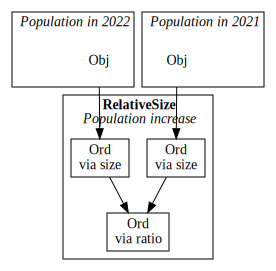

# Table of contents

1.  [Introduction](#introduction)
2.  [Types](#types)
3.  [Expressions](#language-and-expressions)
4.  [Querying](#graphs-and-queries)

# Introduction

`transformation_algebra` is a Python library that allows you to define a 
language for semantically describing tools or procedures as 
*transformations between concepts*. When you connect several such 
procedures into a *workflow*, the library can construct an RDF graph for 
you that describes it as a whole, automatically inferring the specific 
concept type at every step.

Throughout this manual, we will use a simplified version of the [core 
concept transformations of geographical information][cct] as a recurring 
example, as it was the motivating use case for the library. However, you 
can apply it to any other domain.

To create a transformation language, you declare transformation 
operators: the atomic steps with which more complex procedures are 
described. For example, if you have a `NearObject` tool for selecting 
the nearest object, you could describe it in terms of operators like 
`minimum` and `distance`. Alternatively, you could declare a monolithic 
operator `select_nearest_object` that describes the entire tool 
'atomically'. The amount of detail you go into is entirely up to you, 
because the operators don't necessarily specify anything about 
*implementation*: they instead represent *conceptual* steps at whatever 
level of granularity is suitable for your purpose.

[^1]: Just as with transformation operators, type operators don't 
    necessarily correspond to concrete data types --- they only capture 
    some important conceptual properties. That is, when a procedure 
    involves a `Ratio` concept, that also covers `Object`s that happen 
    to have a `Ratio` property.

The names of the operators should provide a hint to their intended 
semantics. However, they have no formal content besides their *type 
signature*. This signature indicates what sort of concepts it 
transforms. For instance, the `distance` transformation might transform 
two *objects* to a *value*. Such concepts are represented with *type 
operators*. So, before defining a transformation language, we should 
understand how these work. Let's start by importing the library:

    >>> import transformation_algebra as ct

Base type operators can be thought of as atomic concepts. In our case, 
that could be an *object* or an *ordinal value*. They are declared using 
the `TypeOperator` class:

    >>> Obj = ct.TypeOperator()
    >>> Ord = ct.TypeOperator()

*Compound* type operators take other types as parameters. For example, 
`C(Obj)` could represent the type of collections of objects:

    >>> C = ct.TypeOperator(params=1)

A `Function` is a special compound type, and it's quite an important 
one: it describes a transformation from one type to another. For 
convenience, the right-associative infix operator `**` has been 
overloaded to act as a function arrow. When we apply a function to an 
input, we get its output, or, if the input type was inappropriate, an 
error:

    >>> (Ord ** Obj).apply(Ord)
    Obj
    >>> (Ord ** Obj).apply(Obj)
    Type mismatch.

We will revisit types at a later point. For now, we know enough to be 
able to make our first transformation language, called `sl`, containing 
the operators `minimum` and `distance`. We already mentioned that a 
`distance` operator would maybe take two objects and output a value.[^2] 
The `minimum` operator could take a set of objects, along with a 
transformation that associates an object with an ordinal value, and 
outputs the smallest object. Transformation operators are declared using 
the `Operator` class, so we would end up with:

    >>> distance = ct.Operator(type=Obj ** Obj ** Ord)
    >>> minimum = ct.Operator(type=(Obj ** Ord) ** C(Obj) ** Obj)

[^2]: A function that takes multiple arguments can be 
    [rewritten][w:currying] to a sequence of functions.

The `Language` class bundles up our types and operators into a 
transformation language. For convenience, you can simply incorporate all 
types and operators in local scope:

    >>> sl = ct.Language(scope=locals())

Now that we have an object that represents the `sl` language, we can use 
its `.parse()` method to parse combinations of operators. Such 
expressions may also contain numbers or dashes `-` to indicate source 
concepts. The notation `expression : type` is used to explicitly 
indicate the type of a sub-expression. For example, the following 
expression represents a concept transformation that selects, from an 
unspecified set of objects, the object that is nearest to some 
unspecified object.

    >>> expr = sl.parse("minimum (distance (- : Obj)) (- : C(Obj))")

If the result typechecks, which it does, we obtain an `Expr` object. We 
can inspect its inferred type and get a representation of its 
sub-expressions:

    >>> print(expr.tree())
    Obj
     ├─C(Obj) → Obj
     │  ├─╼ minimum : (Obj → Ord) → C(Obj) → Obj
     │  └─Obj → Ord
     │     ├─╼ distance : Obj → Obj → Ord
     │     └─╼ - : Obj
     └─╼ - : C(Obj)

It is now time to construct a simple workflow. We will use RDF for that, 
using [Turtle][w:ttl] syntax and the [Workflow][wf] vocabulary. First, 
we describe the `NearObject` tool:

    @prefix : <http://example.com/#>.
    :NearObject
        :expression "minimum (distance (1: Obj)) (2: C(Obj))".

Now, our workflow will use this tool to find the nearest hospital:

    @prefix wf: <http://geographicknowledge.de/vocab/Workflow.rdf#>.

    :SimpleWorkflow a wf:Workflow;
        wf:source _:hospitals, _:incident;
        wf:edge [
            wf:applicationOf :NearObject;
            wf:input1 _:incident;
            wf:input2 _:hospitals;
            wf:output _:nearest_hospital
        ].

Save the transformation language into [`sl.py`](resource/sl.py), and the 
workflow and tool description into [`wf.ttl`](resource/wf.ttl). We can 
now use `transformation_algebra`'s command-line interface[^3] to 
construct a transformation graph for our workflow. What we get back 
looks something like this:

    python -m transformation_algebra graph \
        -L sl.py -T wf.ttl wf.ttl -o output.ttl -t ttl

This graph represents what happens 'inside' the workflow. 
Chronologically, the distance is an ordinal value that has to be 
considered *before* taking the minimum, which produced. Of course, the 
example is trivial: there is only one tool, and each operator has a very 
specific signature. In what follows, we will go into more advanced 
features.

[^3]: Run `python -m transformation_algebra -h` for information on how 
    the command-line interface works. You can also interface with Python 
    directly; checking out the source code for the command-line 
    interface should give you a headstart.

[^4]: You might notice that there is a dashed node before the distance. 
    This is due to the fact that `distance` was an argument to another 
    transformation, so it may internally use information that was passed 
    to `minimum`, which indeed it does: `distance` needs to know about 
    the incident location as well as the hospital locations.

* * *

What follows is work-in-progress.

# Polymorphism

### Subtype polymorphism

Base types may have sub- and supertypes. For instance, an ratio-scaled 
quality is also an ordinal value, but not vice versa:

    >>> Ord = ct.TypeOperator(supertype=Qlt)
    >>> Ratio = ct.TypeOperator(supertype=Ord)
    >>> Ratio.subtype(Ord)
    True
    >>> Ord.subtype(Ratio)
    False

This automatically extends to compound types:

    >>> C(Ratio).subtype(C(Ord))
    True

An operator may take another operator as an argument. An operator that 
takes

Functional types, too, may be representative of any of its 

These types are *polymorphic* in that any type is also a representative 
of any of its supertypes. That is, an operator that expects an argument 
of type `Ord ** Ord` would also accept `Qlt ** Ord` or `Ord ** Ratio`.

    >>> ((Ord ** Ord) ** Qlt).apply(Qlt ** Ord)
    Qlt
    >>> ((Ord ** Ord) ** Qlt).apply(Ord ** Ratio)
    Qlt

### Parametric polymorphism

We additionally allow *parametric polymorphism* by means of the 
`TypeSchema` class, which represents all types that can be obtained by 
substituting its type variables:

    >>> compose = ct.TypeSchema(lambda α, β, γ:
            (β ** γ) ** (α ** β) ** (α ** γ))
    >>> compose.apply(f).apply(g)
    Int ** Real

Don't be fooled by the `lambda` keyword: it has little to do with lambda 
abstraction. It is there because we use an anonymous Python function, whose 
parameters declare the *schematic* type variables that occur in its body. When 
the type schema is used somewhere, the schematic variables are automatically 
instantiated with *concrete* variables.

### Constraints

Often, variables in a schema cannot be just *any* type. We can abuse indexing 
notation (`x [...]`) to *constrain* a type. A constraint can be a *subtype* 
constraint, written `x <= y`, meaning that `x`, once it is unified, must be a 
subtype of the given type `y`. It can also be an *elimination* constraint, 
written `x << {y, z}`, meaning that `x` will be unified to a subtype one of the 
options as soon as the alternatives have been eliminated. For instance, we 
might want a function signature that applies to both single integers and sets 
of integers:

    >>> f = TypeSchema(lambda α: α ** α [α << {Int, Set(Int)}])
    >>> f.apply(Set(Nat))
    Set(Nat)

As an aside: when you need a type variable, but you don't care how it relates 
to others, you may use the *wildcard variable* `_`. The purpose goes beyond 
convenience: it communicates to the type system that it can always be a sub- 
and supertype of *anything*. It must be explicitly imported:

    >>> from transformation_algebra import _
    >>> f = Set(_) ** Int

Typeclass constraints and wildcards can often aid in inference, figuring out 
interdependencies between types:

    >>> Map = ct.TypeOperator('Map', params=2)
    >>> f = TypeSchema(lambda α, β: α ** β [α << {Set(β), Map(β, _)}])
    >>> f.apply(Set(Int))
    Int

### Type inference

In the presence of subtypes, type inference can be less than straightforward. 
Consider that, when you apply a function of type `τ ** τ ** τ` to an argument 
with a concrete type, say `A`, then we cannot immediately bind `τ` to `A`: what 
if the second argument to the function is a supertype of `A`? We can, however, 
deduce that `τ >= A`, since any more specific type would certainly be too 
restrictive. This does not suggest that providing a *value* of a more specific 
type is illegal --- just that the signature should be more general. Only once 
all arguments have been supplied can `τ` be fixed to the most specific type 
possible.

This is why it's sometimes necessary to say `τ ** τ ** τ [τ <= A]` rather than 
just `A ** A ** A`: while the two are identical in what types they *accept*, 
the former can produce an *output type* that is more specific than `A`.

# Language and expressions

### Composite operators

It is possible to define *composite* transformations: transformations that are 
derived from other, simpler ones. This should not necessarily be thought of as 
providing an *implementation*: it merely represents a decomposition into more 
primitive conceptual building blocks.

    >>> add1 = ct.Operator(
            type=Int ** Int,
            define=lambda x: add(x, ct.Source(Int))
        )
    >>> compose = ct.Operation(
            type=lambda α, β, γ: (β ** γ) ** (α ** β) ** (α ** γ),
            define=lambda f, g, x: f(g(x))
        )

When we use such composite operations, we can derive the underlying primitive 
expression using `.primitive()`:

    >>> expr = lang.parse("compose add1 add1 (-: Nat)")
    >>> print(expr.primitive().tree())
    Int
     ├─Int ** Int
     │  ├─╼ add : Int ** Int ** Int
     │  └─Int
     │     ├─Int ** Int
     │     │  ├─╼ add : Int ** Int ** Int
     │     │  └─╼ - : Int
     │     └─╼ - : Int
     └─╼ - : Nat

# Graphs and queries

Beyond *expressing* transformations, an additional goal of the library is to 
enable *querying* them for their constituent operations and data types.

To turn an expression into a searchable structure, we convert it to an RDF 
graph. Every data source and every operation applied to it becomes a node, 
representing the type of data that is conceptualized at that particular step in 
the transformation. Chains of nodes are thus obtained that are easily subjected 
to queries along the lines of: 'find me a transformation containing operations 
`f` and `g` that, somewhere downstream, combine into data of type `t`'.

The process is straightforward when operations only take data as input. 
However, expressions in an algebra may also take other operations, in which 
case the process is more involved; for now, consult the source code.

In practical terms, to obtain a graph representation of the previous 
expression, you may do:

    >>> g = ct.TransformationGraph()
    >>> g.add_expr(expr)
    >>> g.serialize("graph.ttl", format="ttl")

These graphs can be queried via constructs from the [SPARQL 1.1 
specification](https://www.w3.org/TR/sparql11-query/).

[cct]: https://github.com/quangis/cct
[wf]: http://geographicknowledge.de/vocab/Workflow.rdf#
[w:ttl]: https://en.wikipedia.org/wiki/Turtle_(syntax)
[w:currying]: https://en.wikipedia.org/wiki/Currying
